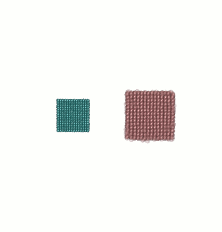

# FMD - a classical molecular dynamics library

<p align="center">
  
</p>

## About FMD
Free Molecular Dynamics (FMD) is a library for performing classical molecular dynamics (MD) simulations on different kinds of computers, from laptops to computer clusters. Its core part, which particularly executes all computationally expensive operations, is written in C for efficiency. Another part of FMD, written in Python and named PyFMD, adds features which are essential for many, if not most, simulations. PyFMD also provides Python programmers with an object-oriented interface for interacting with the core part of FMD within Python programs.

FMD is a growing project. At the moment, its features and capabilities include:

- can be run on personal computers, workstations, clusters and supercomputers
  - uses MPI for distributed-memory message-passing parallelism
  - uses OpenMP for shared-memory parallelism
- can create different structures of atoms (provided by PyFMD)
- can be used in C and Python programs
- can save atomic coordinates in [XYZ](https://en.wikipedia.org/wiki/XYZ_file_format), [VTF](https://github.com/olenz/vtfplugin/wiki/VTF-format)  and [CSV](https://en.wikipedia.org/wiki/Comma-separated_values) formats
- supports EAM, Morse, and Lennard-Jones potentials
- provides Berendsen thermostat
- provides microcanonical NVE ensemble
- can save checkpoints for continuing a simulation

While all features of the core can be accessed via PyFMD, currently the core cannot directly use features which are added by PyFMD. So, for example, if you would like to work with a Body-Centered Cubic (bcc) structure in a C program, you have to create and save it with a small Python code which uses PyFMD, and then load the saved structure in your C program from your storage device.

## Compiling the core

The core part of FMD depends on

- MPI (e.g. OpenMPI or MPICH)
- GNU Scientific Library

which means that the binary files and header files of these libraries have to be installed so that you can compile the core. You will also need an installed C compiler.

To compile the core in Linux or hopefully any other Unix-like environment, open the terminal/[CLI](https://en.wikipedia.org/wiki/Command-line_interface) and change the current directory to `src`. Then simply enter the following command:

```
make
```

This compiles the core and makes `libfmd.so` in the `src` directory. This binary file and the header file `fmd.h`, which is already placed in `src` directory, are needed for linking FMD to your C programs.

## Using PyFMD

Requirements:

- [numpy](https://www.numpy.org/) >= 1.12
- [ase](https://wiki.fysik.dtu.dk/ase/) >= 3.15.0
- [periodictable](https://pypi.org/project/periodictable/) >= 1.5.0
- for a direct MD simulation, make sure the `LD_LIBRARY_PATH` includes path to `src` directory.

How to install:
```python
python setup.py install  # dependencies may be automatically installed
```

How to use:

```Python
import pyfmd
```

## The examples

The example C and Python programs in the `examples` directory show how to use FMD in practice. They could be seen as a good starting point for getting acquainted with FMD. The program files include the instructions needed for compiling and/or running the examples and contain good amount of comments to show what the purpose of each line is.

## Where to get more information

Documentation file(s) will gradually be developed in the `doc` directory.

We welcome questions and comments! If you would like to ask any question related to this project, see the file `AUTHORS` for contact information.
